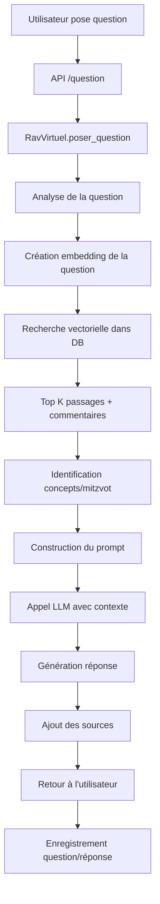
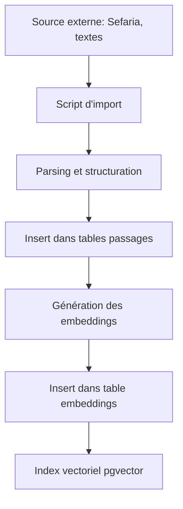

# Architecture de Torah AI - Rav Virtuel

## Vue d'ensemble

Torah AI est une plateforme d'enseignement de la Torah basée sur l'intelligence artificielle, conçue pour être accessible au monde entier. Le système combine une base de données complète de textes sacrés avec des technologies d'IA de pointe pour offrir un "Rav virtuel" sage et bienveillant.

## Principes directeurs

1. **Accessibilité universelle**: Multilingue, gratuit, ouvert à tous
2. **Fidélité aux sources**: Toutes les réponses citent des sources authentiques
3. **Amour et bienveillance**: L'IA répond avec les valeurs juives de Ahavat Israel et 'Hessed
4. **Pédagogie**: Adaptation au niveau de l'utilisateur
5. **Évolutivité**: Architecture scalable pour servir le monde entier

## Stack technologique

### Backend

- **Langage**: Python 3.11+
- **Framework Web**: FastAPI (haute performance, async)
- **ORM**: SQLAlchemy 2.0
- **Validation**: Pydantic v2

### Base de données

- **SGBD**: PostgreSQL 14+
- **Extension vectorielle**: pgvector pour la recherche sémantique
- **Schéma**: Voir `database/schema.sql`

#### Structure des données

```
Categories (Torah, Mishna, Talmud, Kabbalah...)
  └─ Livres (Genèse, Exode, Mishna Berakhot...)
      └─ Chapitres
          └─ Passages
              ├─ Commentaires (Rashi, Ramban...)
              └─ Embeddings (recherche sémantique)
```

**Tables principales:**
- `categories`: Grandes catégories de textes
- `livres`: Livres individuels (Sfarim)
- `chapitres`: Chapitres/sections
- `passages`: Versets/passages individuels (multilingue)
- `commentaires`: Commentaires des Sages (Perushim)
- `embeddings`: Vecteurs pour recherche sémantique
- `mitzvot`: Les 613 commandements
- `concepts_kabbalah`: Concepts mystiques
- `halakhot`: Décisions de loi juive
- `glossaire`: Termes hébreux et traductions

### Intelligence Artificielle

#### Recherche sémantique
- **Embeddings**: Sentence Transformers (paraphrase-multilingual-mpnet-base-v2)
- **Dimension**: 768 (ajustable selon le modèle)
- **Recherche**: Similarité cosinus via pgvector

#### Génération de réponses
- **Modèle principal**: GPT-4 Turbo ou Claude 3
- **Approche**: RAG (Retrieval-Augmented Generation)
- **Pipeline**:
  1. Analyser la question
  2. Rechercher les sources pertinentes (via embeddings)
  3. Construire le contexte avec les sources
  4. Générer la réponse avec le LLM
  5. Ajouter les références

#### Personnalité du Rav

Le prompt système définit le Rav comme:
- Sage et érudit
- Bienveillant et patient
- Humble
- Citant toujours ses sources
- Adaptant son niveau d'enseignement

### API REST

#### Endpoints principaux

```
POST /api/v1/question
  - Poser une question au Rav
  - Entrée: question, langue, niveau
  - Sortie: réponse, sources, concepts liés

POST /api/v1/recherche
  - Rechercher dans les textes
  - Recherche sémantique multilingue

GET /api/v1/enseignement-quotidien
  - Enseignement inspirant du jour

GET /api/v1/parasha/{nom}
  - Explication de la Parasha hebdomadaire

GET /api/v1/mitzvot
  - Lister les 613 mitzvot

GET /api/v1/glossaire/{terme}
  - Dictionnaire hébreu-français-anglais
```

#### Standards

- Format: JSON
- Authentification: JWT (optionnel)
- Rate limiting: 60 req/min par défaut
- CORS: Activé pour accès mondial
- Documentation: OpenAPI/Swagger automatique

## Flux de données

### Question → Réponse



### Import de textes



## Modules principaux

### `models/base.py`
Modèles SQLAlchemy pour toutes les entités:
- Catégorie, Livre, Chapitre, Passage
- Commentaire, Mitzva, ConceptKabbalah
- Embedding, Question, Reponse

### `ai/rav_virtuel.py`
Classe `RavVirtuel` - Cœur de l'IA:
- `poser_question()`: Point d'entrée principal
- `_analyser_question()`: Comprendre l'intention
- `_rechercher_sources()`: Recherche vectorielle
- `_generer_reponse()`: Appel LLM avec contexte
- `_construire_prompt_systeme()`: Définit la personnalité

Classe `GestionnaireEmbeddings`:
- Création et gestion des embeddings
- Support multilingue

### `api/main.py`
API FastAPI avec tous les endpoints

### `scripts/init_db.py`
Initialisation de la base de données

## Multilinguisme

### Langues supportées
- Hébreu (he) - Langue source
- Français (fr)
- Anglais (en)
- Espagnol (es)
- Russe (ru)

### Implémentation
- Chaque passage stocké en hébreu + traductions
- Embeddings générés par langue
- LLM répond dans la langue demandée
- Glossaire pour les termes techniques

## Recherche sémantique

### Pourquoi pgvector?

1. **Intégration native**: Directement dans PostgreSQL
2. **Performance**: Index IVFFlat pour recherches rapides
3. **Scalabilité**: Milliards de vecteurs possibles
4. **Simplicité**: Une seule base de données

### Comment ça marche?

1. **À l'insertion**:
   - Texte → Modèle d'embedding → Vecteur 768D
   - Stockage dans table `embeddings`

2. **À la recherche**:
   - Question → Vecteur 768D
   - Recherche: `ORDER BY embedding <=> question_vector`
   - Retourne les K plus similaires (cosine similarity)

## Sécurité et Éthique

### Sécurité
- Clés API en variables d'environnement
- Rate limiting pour éviter abus
- Validation des entrées (Pydantic)
- Sanitisation SQL (SQLAlchemy ORM)

### Éthique
- Filtrage de contenu inapproprié
- Pas de questions halakhiques tranchantes (renvoyer à un Rav réel)
- Transparence sur les sources
- Respect de la tradition juive

## Performance

### Optimisations

1. **Base de données**:
   - Index sur colonnes fréquemment recherchées
   - Index vectoriel pgvector
   - Vues matérialisées pour requêtes complexes

2. **API**:
   - Cache Redis pour requêtes fréquentes
   - Async/await pour non-blocking I/O
   - Pagination des résultats

3. **IA**:
   - Cache des embeddings
   - Batch processing pour import massif
   - Modèles optimisés (quantization possible)

### Scalabilité

- **Horizontale**: Plusieurs instances API derrière load balancer
- **Verticale**: PostgreSQL peut gérer des TB de données
- **CDN**: Pour assets statiques
- **Cache distribué**: Redis cluster si nécessaire

## Déploiement

### Environnements

1. **Développement**: Local avec SQLite possible
2. **Staging**: Serveur de test
3. **Production**: Cloud (AWS, GCP, Azure)

### Infrastructure production

```
Internet
  ↓
[Load Balancer]
  ↓
[API Instances x3] ← [Redis Cache]
  ↓
[PostgreSQL + pgvector]
  ↓
[LLM API (OpenAI/Anthropic)]
```

### Monitoring

- Métriques: Prometheus + Grafana
- Logs: Structlog → ELK/Loki
- Alertes: Sur erreurs, latence, quota API
- Health checks: `/health` endpoint

## Évolutions futures

### Court terme
1. Import automatique depuis Sefaria
2. Génération complète des embeddings
3. Interface web (frontend React/Vue)
4. Support audio (questions vocales)

### Moyen terme
1. App mobile (iOS/Android)
2. Chatbot intégré (WhatsApp, Telegram)
3. Personnalisation par utilisateur
4. Mode hors-ligne

### Long terme
1. Modèle IA fine-tuné spécifiquement sur corpus juif
2. Génération d'images (calligraphie hébraïque)
3. Réalité augmentée (visualisation Mishkan)
4. Communauté d'étude en ligne

## Contributing

### Structure des branches
- `main`: Production stable
- `develop`: Intégration continue
- `feature/*`: Nouvelles fonctionnalités
- `fix/*`: Corrections de bugs

### Standards de code
- Black pour formatting Python
- Ruff pour linting
- Type hints (mypy)
- Tests avec pytest
- Documentation docstrings

## Ressources

### Documentation
- FastAPI: https://fastapi.tiangolo.com
- pgvector: https://github.com/pgvector/pgvector
- Sefaria API: https://github.com/Sefaria/Sefaria-Project/wiki/API-Documentation

### Sources de données
- Sefaria.org (API gratuite)
- Mechon Mamre
- WikiSource hébreux
- Chabad.org

---

*Architecture conçue avec soin pour servir et éduquer avec amour*

**"עשה לך רב" - "Fais-toi un maître" (Pirke Avot 1:6)**
